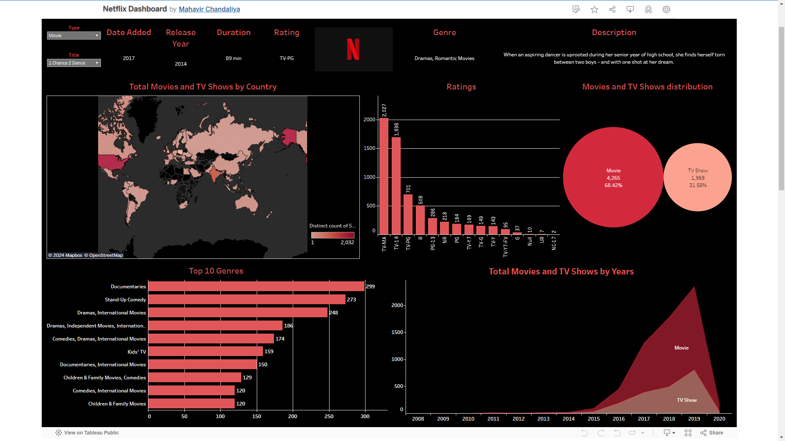

# Netflix Dashboard using Tableau Public



Welcome to the Netflix Dashboard repository! This project showcases a comprehensive analysis of Netflix data using Tableau Public Desktop. The dashboard is designed to provide insights into various aspects of Netflix's catalog, including genre distribution, release trends, and ratings.

## Dashboard Link

You can view the published dashboard on Tableau Public by following this link: [Netflix Dashboard on Tableau Public](https://public.tableau.com/views/NetflixDashboard_17161830015120/Netflix?:language=en-US&:sid=&:display_count=n&:origin=viz_share_link)

## Getting Started

To get a local copy up and running, follow these simple steps:

### Prerequisites

- Tableau Public Desktop: Download and install [Tableau Public](https://public.tableau.com/en-us/s/download).

### Installation

1. Clone the repo:
   ```sh
   git clone https://github.com/yourusername/netflix-dashboard.git
   ```
2. Open Tableau Public Desktop.
3. Open the `.twbx` file from the cloned repository.

## Usage

- Explore the visualizations to gain insights into Netflix's content.
- Use filters to customize the view according to your preferences.
- Hover over charts to see detailed information.

## Contributing

Contributions are what make the open-source community such an amazing place to learn, inspire, and create. Any contributions you make are **greatly appreciated**.

1. Fork the Project
2. Create your Feature Branch (`git checkout -b feature/AmazingFeature`)
3. Commit your Changes (`git commit -m 'Add some AmazingFeature'`)
4. Push to the Branch (`git push origin feature/AmazingFeature`)
5. Open a Pull Request

Project Link: [https://github.com/docmhvr/netflix-dashboard](https://github.com/docmhvr/Netflix_Tableau_Viz)

Thank you for checking out the Netflix Dashboard! If you have any questions or feedback, feel free to reach out. Happy analyzing!
